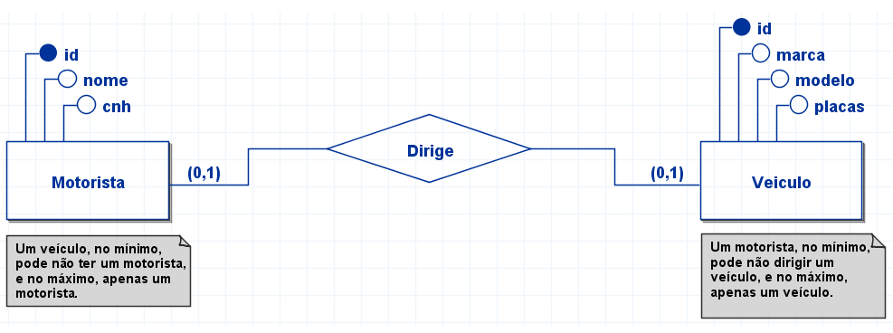

## <B>MER</B> (Modelo Entidade-Relacionamento) e <B>DER</B> (Diagrama Entidade-Relacionamento)

- Prof. Marcelo Gonçalves de Souza

### Cardinalidades 1 (um) para 1 (um)

<p align="center">
  
</p>

### No modelo lógico pode-se interpretar de duas formas:

1. Usa-se a regra do um para muitos:

- Motorista (<b>id</b>, nome, cnh)
- Veiculo (<b>id</b>, marca, modelo, placas, @id_motorista)<br />
      id_motorista referencia Motorista (id)

2. Usa-se uma tabela única

- Motorista_veiculo (<b>id</b>, nome, cnh, marca, modelo, placas)

### No modelo físico - primeira forma:

```
CREATE TABLE motorista(
  id BIGINT AUTO_INCREMENT,
  nome VARCHAR(128) NOT NULL,
  cnh VARCHAR(128) NOT NULL,
  PRIMARY KEY (id)
);
```
```
CREATE TABLE veiculo(
  id BIGINT AUTO_INCREMENT,
  marca VARCHAR(32) NOT NULL,
  modelo VARCHAR(64) NOT NULL,
  placas VARCHAR(16) NOT NULL,
  id_motorista BIGINT NULL,
  FOREIGN KEY (id_motorista) REFERENCES motorista (id),
  PRIMARY KEY (id)
);
```
### No modelo físico - segunda forma:
```
CREATE TABLE motorista_veiculo(
  id BIGINT AUTO_INCREMENT,
  nome VARCHAR(128) NOT NULL,
  cnh VARCHAR(128) NOT NULL,
  marca VARCHAR(32) NULL,
  modelo VARCHAR(64) NULL,
  placas VARCHAR(16) NULL,
  PRIMARY KEY (id)
);
```